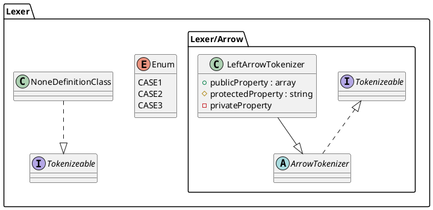

# PlantUML parser for PHP
## Overview
This package builds AST of class definitions from plantuml files. This package works only with php.

## Installation
Via Composer
```shell
composer require puml2php/puml-parser
```

## Usage
sample PlantUML source file.

Basically, it is assumed that each class definition will be manipulated after it is converted to DTO.
```php
<?php

use PumlParser\Lexer\Lexer;
use PumlParser\Lexer\PumlTokenizer;
use PumlParser\Parser\Parser;

$lexer  = new Lexer(new PumlTokenizer());
$parser = new Parser($lexer);
$ast    = $parser->parse(__DIR__ . '/sample.puml');

foreach ($ast->toDtos() as $definition) {
    echo "----------\n";

    echo "name: " . $definition->getName() . "\n";
    echo "package: " . $definition->getPackage() . "\n";

    if ($definition->getType() === 'enum') {
        foreach ($definition->getCases() as $case) {
            echo "case: " . $case . "\n";
        }
    } else {
        foreach ($definition->getProperties() as $property) {
            echo "property name: " . $property->getName() . " , visibility:  " . $property->getVisibility() . "\n";
        }
    }
}
```
```shell
$ php sample.php
----------
name: Tokenizeable
package: Lexer
----------
name: ArrowTokenizer
package: Lexer\Arrow
----------
name: LeftArrowTokenizer
package: Lexer\Arrow
property name: publicProperty , visibility:  public
property name: protectedProperty , visibility:  protected
property name: privateProperty , visibility:  private
----------
name: Enum
package: Lexer
case: CASE1
case: CASE2
case: CASE3
----------
name: NoneDefinitionClass
package: Lexer
```

---

Support for three parsing results. They are json, array, and Dto.
```php
<?php

use PumlParser\Lexer\Lexer;
use PumlParser\Lexer\PumlTokenizer;
use PumlParser\Parser\Parser;

$lexer  = new Lexer(new PumlTokenizer());
$parser = new Parser($lexer);
$ast    = $parser->parse(__DIR__ . '/sample.puml');
```
<details><summary>dump $ast->toDtos()</summary><div>

```shell
array(4) {
  [0]=>
  object(PumlParser\Dto\Definition)#59 (6) {
    ["name":"PumlParser\Dto\Definition":private]=>
    string(12) "Tokenizeable"
    ["type":"PumlParser\Dto\Definition":private]=>
    string(9) "interface"
    ["package":"PumlParser\Dto\Definition":private]=>
    string(5) "Lexer"
    ["properties":"PumlParser\Dto\Definition":private]=>
    array(0) {
    }
    ["parents":"PumlParser\Dto\Definition":private]=>
    array(0) {
    }
    ["interfaces":"PumlParser\Dto\Definition":private]=>
    array(0) {
    }
  }
  [1]=>
  object(PumlParser\Dto\Definition)#62 (6) {
    ["name":"PumlParser\Dto\Definition":private]=>
    string(14) "ArrowTokenizer"
    ["type":"PumlParser\Dto\Definition":private]=>
    string(14) "abstract class"
    ["package":"PumlParser\Dto\Definition":private]=>
    string(11) "Lexer\Arrow"
    ["properties":"PumlParser\Dto\Definition":private]=>
    array(0) {
    }
    ["parents":"PumlParser\Dto\Definition":private]=>
    array(0) {
    }
    ["interfaces":"PumlParser\Dto\Definition":private]=>
    array(1) {
      [0]=>
      object(PumlParser\Dto\Definition)#46 (6) {
        ["name":"PumlParser\Dto\Definition":private]=>
        string(12) "Tokenizeable"
        ["type":"PumlParser\Dto\Definition":private]=>
        string(9) "interface"
        ["package":"PumlParser\Dto\Definition":private]=>
        string(5) "Lexer"
        ["properties":"PumlParser\Dto\Definition":private]=>
        array(0) {
        }
        ["parents":"PumlParser\Dto\Definition":private]=>
        array(0) {
        }
        ["interfaces":"PumlParser\Dto\Definition":private]=>
        array(0) {
        }
      }
    }
  }
  [2]=>
  object(PumlParser\Dto\Definition)#61 (6) {
    ["name":"PumlParser\Dto\Definition":private]=>
    string(18) "LeftArrowTokenizer"
    ["type":"PumlParser\Dto\Definition":private]=>
    string(5) "class"
    ["package":"PumlParser\Dto\Definition":private]=>
    string(11) "Lexer\Arrow"
    ["properties":"PumlParser\Dto\Definition":private]=>
    array(3) {
      [0]=>
      object(PumlParser\Dto\PropertyDefinition)#34 (2) {
        ["name":"PumlParser\Dto\PropertyDefinition":private]=>
        string(14) "publicProperty"
        ["visibility":"PumlParser\Dto\PropertyDefinition":private]=>
        string(6) "public"
      }
      [1]=>
      object(PumlParser\Dto\PropertyDefinition)#33 (2) {
        ["name":"PumlParser\Dto\PropertyDefinition":private]=>
        string(17) "protectedProperty"
        ["visibility":"PumlParser\Dto\PropertyDefinition":private]=>
        string(9) "protected"
      }
      [2]=>
      object(PumlParser\Dto\PropertyDefinition)#60 (2) {
        ["name":"PumlParser\Dto\PropertyDefinition":private]=>
        string(15) "privateProperty"
        ["visibility":"PumlParser\Dto\PropertyDefinition":private]=>
        string(7) "private"
      }
    }
    ["parents":"PumlParser\Dto\Definition":private]=>
    array(1) {
      [0]=>
      object(PumlParser\Dto\Definition)#26 (6) {
        ["name":"PumlParser\Dto\Definition":private]=>
        string(14) "ArrowTokenizer"
        ["type":"PumlParser\Dto\Definition":private]=>
        string(14) "abstract class"
        ["package":"PumlParser\Dto\Definition":private]=>
        string(11) "Lexer\Arrow"
        ["properties":"PumlParser\Dto\Definition":private]=>
        array(0) {
        }
        ["parents":"PumlParser\Dto\Definition":private]=>
        array(0) {
        }
        ["interfaces":"PumlParser\Dto\Definition":private]=>
        array(1) {
          [0]=>
          object(PumlParser\Dto\Definition)#57 (6) {
            ["name":"PumlParser\Dto\Definition":private]=>
            string(12) "Tokenizeable"
            ["type":"PumlParser\Dto\Definition":private]=>
            string(9) "interface"
            ["package":"PumlParser\Dto\Definition":private]=>
            string(5) "Lexer"
            ["properties":"PumlParser\Dto\Definition":private]=>
            array(0) {
            }
            ["parents":"PumlParser\Dto\Definition":private]=>
            array(0) {
            }
            ["interfaces":"PumlParser\Dto\Definition":private]=>
            array(0) {
            }
          }
        }
      }
    }
    ["interfaces":"PumlParser\Dto\Definition":private]=>
    array(0) {
    }
  }
  [3]=>
  object(PumlParser\Dto\Definition)#41 (6) {
    ["name":"PumlParser\Dto\Definition":private]=>
    string(19) "NoneDefinitionClass"
    ["type":"PumlParser\Dto\Definition":private]=>
    string(5) "class"
    ["package":"PumlParser\Dto\Definition":private]=>
    string(5) "Lexer"
    ["properties":"PumlParser\Dto\Definition":private]=>
    array(0) {
    }
    ["parents":"PumlParser\Dto\Definition":private]=>
    array(0) {
    }
    ["interfaces":"PumlParser\Dto\Definition":private]=>
    array(1) {
      [0]=>
      object(PumlParser\Dto\Definition)#56 (6) {
        ["name":"PumlParser\Dto\Definition":private]=>
        string(12) "Tokenizeable"
        ["type":"PumlParser\Dto\Definition":private]=>
        string(9) "interface"
        ["package":"PumlParser\Dto\Definition":private]=>
        string(5) "Lexer"
        ["properties":"PumlParser\Dto\Definition":private]=>
        array(0) {
        }
        ["parents":"PumlParser\Dto\Definition":private]=>
        array(0) {
        }
        ["interfaces":"PumlParser\Dto\Definition":private]=>
        array(0) {
        }
      }
    }
  }
}
```
</div></details>
<details><summary>dump $ast->toJson()</summary><div>

```json
[
    {
        "interface": {
            "Name": "Tokenizeable",
            "Package": "Lexer",
            "Propaties": [],
            "Parents": [],
            "Interfaces": []
        }
    },
    {
        "abstract class": {
            "Name": "ArrowTokenizer",
            "Package": "Lexer/Arrow",
            "Propaties": [],
            "Parents": [],
            "Interfaces": [
                {
                    "interface": {
                        "Name": "Tokenizeable",
                        "Package": "Lexer",
                        "Propaties": [],
                        "Parents": [],
                        "Interfaces": []
                    }
                }
            ]
        }
    },
    {
        "class": {
            "Name": "LeftArrowTokenizer",
            "Package": "Lexer/Arrow",
            "Propaties": [
                {
                    "name": "publicProperty",
                    "visibility": "public"
                },
                {
                    "name": "protectedProperty",
                    "visibility": "protected"
                },
                {
                    "name": "privateProperty",
                    "visibility": "private"
                }
            ],
            "Parents": [
                {
                    "abstract class": {
                        "Name": "ArrowTokenizer",
                        "Package": "Lexer/Arrow",
                        "Propaties": [],
                        "Parents": [],
                        "Interfaces": [
                            {
                                "interface": {
                                    "Name": "Tokenizeable",
                                    "Package": "Lexer",
                                    "Propaties": [],
                                    "Parents": [],
                                    "Interfaces": []
                                }
                            }
                        ]
                    }
                }
            ],
            "Interfaces": []
        }
    },
    {
        "class": {
            "Name": "NoneDefinitionClass",
            "Package": "Lexer",
            "Propaties": [],
            "Parents": [],
            "Interfaces": [
                {
                    "interface": {
                        "Name": "Tokenizeable",
                        "Package": "Lexer",
                        "Propaties": [],
                        "Parents": [],
                        "Interfaces": []
                    }
                }
            ]
        }
    }
]
```
</div></details>
<details><summary>dump $ast->toArray()</summary><div>

```shell
array(4) {
  [0]=>
  array(1) {
    ["interface"]=>
    array(5) {
      ["Name"]=>
      string(12) "Tokenizeable"
      ["Package"]=>
      string(5) "Lexer"
      ["Propaties"]=>
      array(0) {
      }
      ["Parents"]=>
      array(0) {
      }
      ["Interfaces"]=>
      array(0) {
      }
    }
  }
  [1]=>
  array(1) {
    ["abstract class"]=>
    array(5) {
      ["Name"]=>
      string(14) "ArrowTokenizer"
      ["Package"]=>
      string(11) "Lexer/Arrow"
      ["Propaties"]=>
      array(0) {
      }
      ["Parents"]=>
      array(0) {
      }
      ["Interfaces"]=>
      array(1) {
        [0]=>
        array(1) {
          ["interface"]=>
          array(5) {
            ["Name"]=>
            string(12) "Tokenizeable"
            ["Package"]=>
            string(5) "Lexer"
            ["Propaties"]=>
            array(0) {
            }
            ["Parents"]=>
            array(0) {
            }
            ["Interfaces"]=>
            array(0) {
            }
          }
        }
      }
    }
  }
  [2]=>
  array(1) {
    ["class"]=>
    array(5) {
      ["Name"]=>
      string(18) "LeftArrowTokenizer"
      ["Package"]=>
      string(11) "Lexer/Arrow"
      ["Propaties"]=>
      array(3) {
        [0]=>
        array(2) {
          ["name"]=>
          string(14) "publicProperty"
          ["visibility"]=>
          string(6) "public"
        }
        [1]=>
        array(2) {
          ["name"]=>
          string(17) "protectedProperty"
          ["visibility"]=>
          string(9) "protected"
        }
        [2]=>
        array(2) {
          ["name"]=>
          string(15) "privateProperty"
          ["visibility"]=>
          string(7) "private"
        }
      }
      ["Parents"]=>
      array(1) {
        [0]=>
        array(1) {
          ["abstract class"]=>
          array(5) {
            ["Name"]=>
            string(14) "ArrowTokenizer"
            ["Package"]=>
            string(11) "Lexer/Arrow"
            ["Propaties"]=>
            array(0) {
            }
            ["Parents"]=>
            array(0) {
            }
            ["Interfaces"]=>
            array(1) {
              [0]=>
              array(1) {
                ["interface"]=>
                array(5) {
                  ["Name"]=>
                  string(12) "Tokenizeable"
                  ["Package"]=>
                  string(5) "Lexer"
                  ["Propaties"]=>
                  array(0) {
                  }
                  ["Parents"]=>
                  array(0) {
                  }
                  ["Interfaces"]=>
                  array(0) {
                  }
                }
              }
            }
          }
        }
      }
      ["Interfaces"]=>
      array(0) {
      }
    }
  }
  [3]=>
  array(1) {
    ["class"]=>
    array(5) {
      ["Name"]=>
      string(19) "NoneDefinitionClass"
      ["Package"]=>
      string(5) "Lexer"
      ["Propaties"]=>
      array(0) {
      }
      ["Parents"]=>
      array(0) {
      }
      ["Interfaces"]=>
      array(1) {
        [0]=>
        array(1) {
          ["interface"]=>
          array(5) {
            ["Name"]=>
            string(12) "Tokenizeable"
            ["Package"]=>
            string(5) "Lexer"
            ["Propaties"]=>
            array(0) {
            }
            ["Parents"]=>
            array(0) {
            }
            ["Interfaces"]=>
            array(0) {
            }
          }
        }
      }
    }
  }
}
```
</div></details>

---

## License
The MIT License (MIT). Please see [LICENSE](https://github.com/tasuku43/puml-parser-php/blob/main/LICENSE) for more information.
