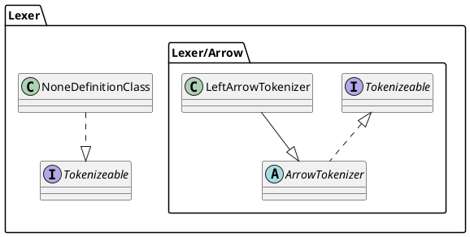

# PlantUML parser for PHP
## Overview
This package builds AST of class definitions from plantuml files.

## Installation
Via Composer
```shell
composer require puml2php/puml-parser
```

## Usage
sample PlantUML source file.

Basically, it is assumed that each class definition will be manipulated after it is converted to DTO.
```php
$parser      = new PumlParser\Parser\Parser();
$difinitions = $parser->parse('/path/to/sample.puml')->toDtos();

foreach ($difinitions as $difinition) {
    /**
     * Code example of using a parsed class definition...
     */
    echo $difinition->getPackage();
    echo $difinition->getName();
    echo $difinition->getPackage();
}
```

---

Support for three parsing results. They are json, array, and Dto.
```php
<?php
$parser = new PumlParser\Parser\Parser();
$ast    = $parser->parse('/path/to/sample.puml');
```
<details><summary>dump $ast->toDtos()</summary><div>

```shell
array(6) {
  [0]=>
  object(PumlParser\Dto\Difinition)#52 (5) {
    ["name":"PumlParser\Dto\Difinition":private]=>
    string(12) "Tokenizeable"
    ["type":"PumlParser\Dto\Difinition":private]=>
    string(9) "interface"
    ["package":"PumlParser\Dto\Difinition":private]=>
    string(5) "Lexer"
    ["parents":"PumlParser\Dto\Difinition":private]=>
    array(0) {
    }
    ["interfaces":"PumlParser\Dto\Difinition":private]=>
    array(0) {
    }
  }
  [1]=>
  object(PumlParser\Dto\Difinition)#61 (5) {
    ["name":"PumlParser\Dto\Difinition":private]=>
    string(14) "ArrowTokenizer"
    ["type":"PumlParser\Dto\Difinition":private]=>
    string(14) "abstract class"
    ["package":"PumlParser\Dto\Difinition":private]=>
    string(11) "Lexer\Arrow"
    ["parents":"PumlParser\Dto\Difinition":private]=>
    array(0) {
    }
    ["interfaces":"PumlParser\Dto\Difinition":private]=>
    array(1) {
      [0]=>
      object(PumlParser\Dto\Difinition)#64 (5) {
        ["name":"PumlParser\Dto\Difinition":private]=>
        string(12) "Tokenizeable"
        ["type":"PumlParser\Dto\Difinition":private]=>
        string(9) "interface"
        ["package":"PumlParser\Dto\Difinition":private]=>
        string(5) "Lexer"
        ["parents":"PumlParser\Dto\Difinition":private]=>
        array(0) {
        }
        ["interfaces":"PumlParser\Dto\Difinition":private]=>
        array(0) {
        }
      }
    }
  }
  [2]=>
  object(PumlParser\Dto\Difinition)#63 (5) {
    ["name":"PumlParser\Dto\Difinition":private]=>
    string(18) "LeftArrowTokenizer"
    ["type":"PumlParser\Dto\Difinition":private]=>
    string(5) "class"
    ["package":"PumlParser\Dto\Difinition":private]=>
    string(11) "Lexer\Arrow"
    ["parents":"PumlParser\Dto\Difinition":private]=>
    array(1) {
      [0]=>
      object(PumlParser\Dto\Difinition)#66 (5) {
        ["name":"PumlParser\Dto\Difinition":private]=>
        string(14) "ArrowTokenizer"
        ["type":"PumlParser\Dto\Difinition":private]=>
        string(14) "abstract class"
        ["package":"PumlParser\Dto\Difinition":private]=>
        string(11) "Lexer\Arrow"
        ["parents":"PumlParser\Dto\Difinition":private]=>
        array(0) {
        }
        ["interfaces":"PumlParser\Dto\Difinition":private]=>
        array(1) {
          [0]=>
          object(PumlParser\Dto\Difinition)#69 (5) {
            ["name":"PumlParser\Dto\Difinition":private]=>
            string(12) "Tokenizeable"
            ["type":"PumlParser\Dto\Difinition":private]=>
            string(9) "interface"
            ["package":"PumlParser\Dto\Difinition":private]=>
            string(5) "Lexer"
            ["parents":"PumlParser\Dto\Difinition":private]=>
            array(0) {
            }
            ["interfaces":"PumlParser\Dto\Difinition":private]=>
            array(0) {
            }
          }
        }
      }
    }
    ["interfaces":"PumlParser\Dto\Difinition":private]=>
    array(0) {
    }
  }
  [3]=>
  object(PumlParser\Dto\Difinition)#65 (5) {
    ["name":"PumlParser\Dto\Difinition":private]=>
    string(21) "CurlyBracketTokenizer"
    ["type":"PumlParser\Dto\Difinition":private]=>
    string(14) "abstract class"
    ["package":"PumlParser\Dto\Difinition":private]=>
    string(18) "Lexer\CurlyBracket"
    ["parents":"PumlParser\Dto\Difinition":private]=>
    array(0) {
    }
    ["interfaces":"PumlParser\Dto\Difinition":private]=>
    array(1) {
      [0]=>
      object(PumlParser\Dto\Difinition)#70 (5) {
        ["name":"PumlParser\Dto\Difinition":private]=>
        string(12) "Tokenizeable"
        ["type":"PumlParser\Dto\Difinition":private]=>
        string(9) "interface"
        ["package":"PumlParser\Dto\Difinition":private]=>
        string(5) "Lexer"
        ["parents":"PumlParser\Dto\Difinition":private]=>
        array(0) {
        }
        ["interfaces":"PumlParser\Dto\Difinition":private]=>
        array(0) {
        }
      }
    }
  }
  [4]=>
  object(PumlParser\Dto\Difinition)#53 (5) {
    ["name":"PumlParser\Dto\Difinition":private]=>
    string(21) "OpenCurlyBracketToken"
    ["type":"PumlParser\Dto\Difinition":private]=>
    string(5) "class"
    ["package":"PumlParser\Dto\Difinition":private]=>
    string(18) "Lexer\CurlyBracket"
    ["parents":"PumlParser\Dto\Difinition":private]=>
    array(1) {
      [0]=>
      object(PumlParser\Dto\Difinition)#72 (5) {
        ["name":"PumlParser\Dto\Difinition":private]=>
        string(21) "CurlyBracketTokenizer"
        ["type":"PumlParser\Dto\Difinition":private]=>
        string(14) "abstract class"
        ["package":"PumlParser\Dto\Difinition":private]=>
        string(18) "Lexer\CurlyBracket"
        ["parents":"PumlParser\Dto\Difinition":private]=>
        array(0) {
        }
        ["interfaces":"PumlParser\Dto\Difinition":private]=>
        array(1) {
          [0]=>
          object(PumlParser\Dto\Difinition)#74 (5) {
            ["name":"PumlParser\Dto\Difinition":private]=>
            string(12) "Tokenizeable"
            ["type":"PumlParser\Dto\Difinition":private]=>
            string(9) "interface"
            ["package":"PumlParser\Dto\Difinition":private]=>
            string(5) "Lexer"
            ["parents":"PumlParser\Dto\Difinition":private]=>
            array(0) {
            }
            ["interfaces":"PumlParser\Dto\Difinition":private]=>
            array(0) {
            }
          }
        }
      }
    }
    ["interfaces":"PumlParser\Dto\Difinition":private]=>
    array(0) {
    }
  }
  [5]=>
  object(PumlParser\Dto\Difinition)#71 (5) {
    ["name":"PumlParser\Dto\Difinition":private]=>
    string(19) "NoneDefinitionClass"
    ["type":"PumlParser\Dto\Difinition":private]=>
    string(5) "class"
    ["package":"PumlParser\Dto\Difinition":private]=>
    string(5) "Lexer"
    ["parents":"PumlParser\Dto\Difinition":private]=>
    array(0) {
    }
    ["interfaces":"PumlParser\Dto\Difinition":private]=>
    array(1) {
      [0]=>
      object(PumlParser\Dto\Difinition)#75 (5) {
        ["name":"PumlParser\Dto\Difinition":private]=>
        string(12) "Tokenizeable"
        ["type":"PumlParser\Dto\Difinition":private]=>
        string(9) "interface"
        ["package":"PumlParser\Dto\Difinition":private]=>
        string(5) "Lexer"
        ["parents":"PumlParser\Dto\Difinition":private]=>
        array(0) {
        }
        ["interfaces":"PumlParser\Dto\Difinition":private]=>
        array(0) {
        }
      }
    }
  }
}
```
</div></details>
<details><summary>dump $ast->toJson()</summary><div>

```json
[
    {
        "interface": {
            "Name": "Tokenizeable",
            "Package": "Lexer",
            "Parents": [],
            "Interfaces": []
        }
    },
    {
        "abstract class": {
            "Name": "ArrowTokenizer",
            "Package": "Lexer/Arrow",
            "Parents": [],
            "Interfaces": [
                {
                    "interface": {
                        "Name": "Tokenizeable",
                        "Package": "Lexer",
                        "Parents": [],
                        "Interfaces": []
                    }
                }
            ]
        }
    },
    {
        "class": {
            "Name": "LeftArrowTokenizer",
            "Package": "Lexer/Arrow",
            "Parents": [
                {
                    "abstract class": {
                        "Name": "ArrowTokenizer",
                        "Package": "Lexer/Arrow",
                        "Parents": [],
                        "Interfaces": [
                            {
                                "interface": {
                                    "Name": "Tokenizeable",
                                    "Package": "Lexer",
                                    "Parents": [],
                                    "Interfaces": []
                                }
                            }
                        ]
                    }
                }
            ],
            "Interfaces": []
        }
    },
    {
        "abstract class": {
            "Name": "CurlyBracketTokenizer",
            "Package": "Lexer/CurlyBracket",
            "Parents": [],
            "Interfaces": [
                {
                    "interface": {
                        "Name": "Tokenizeable",
                        "Package": "Lexer",
                        "Parents": [],
                        "Interfaces": []
                    }
                }
            ]
        }
    },
    {
        "class": {
            "Name": "OpenCurlyBracketToken",
            "Package": "Lexer/CurlyBracket",
            "Parents": [
                {
                    "abstract class": {
                        "Name": "CurlyBracketTokenizer",
                        "Package": "Lexer/CurlyBracket",
                        "Parents": [],
                        "Interfaces": [
                            {
                                "interface": {
                                    "Name": "Tokenizeable",
                                    "Package": "Lexer",
                                    "Parents": [],
                                    "Interfaces": []
                                }
                            }
                        ]
                    }
                }
            ],
            "Interfaces": []
        }
    },
    {
        "class": {
            "Name": "NoneDefinitionClass",
            "Package": "Lexer",
            "Parents": [],
            "Interfaces": [
                {
                    "interface": {
                        "Name": "Tokenizeable",
                        "Package": "Lexer",
                        "Parents": [],
                        "Interfaces": []
                    }
                }
            ]
        }
    }
]
```
</div></details>
<details><summary>dump $ast->toArray()</summary><div>

```shell
array(6) {
  [0]=>
  array(1) {
    ["interface"]=>
    array(4) {
      ["Name"]=>
      string(12) "Tokenizeable"
      ["Package"]=>
      string(5) "Lexer"
      ["Parents"]=>
      array(0) {
      }
      ["Interfaces"]=>
      array(0) {
      }
    }
  }
  [1]=>
  array(1) {
    ["abstract class"]=>
    array(4) {
      ["Name"]=>
      string(14) "ArrowTokenizer"
      ["Package"]=>
      string(11) "Lexer/Arrow"
      ["Parents"]=>
      array(0) {
      }
      ["Interfaces"]=>
      array(1) {
        [0]=>
        array(1) {
          ["interface"]=>
          array(4) {
            ["Name"]=>
            string(12) "Tokenizeable"
            ["Package"]=>
            string(5) "Lexer"
            ["Parents"]=>
            array(0) {
            }
            ["Interfaces"]=>
            array(0) {
            }
          }
        }
      }
    }
  }
  [2]=>
  array(1) {
    ["class"]=>
    array(4) {
      ["Name"]=>
      string(18) "LeftArrowTokenizer"
      ["Package"]=>
      string(11) "Lexer/Arrow"
      ["Parents"]=>
      array(1) {
        [0]=>
        array(1) {
          ["abstract class"]=>
          array(4) {
            ["Name"]=>
            string(14) "ArrowTokenizer"
            ["Package"]=>
            string(11) "Lexer/Arrow"
            ["Parents"]=>
            array(0) {
            }
            ["Interfaces"]=>
            array(1) {
              [0]=>
              array(1) {
                ["interface"]=>
                array(4) {
                  ["Name"]=>
                  string(12) "Tokenizeable"
                  ["Package"]=>
                  string(5) "Lexer"
                  ["Parents"]=>
                  array(0) {
                  }
                  ["Interfaces"]=>
                  array(0) {
                  }
                }
              }
            }
          }
        }
      }
      ["Interfaces"]=>
      array(0) {
      }
    }
  }
  [3]=>
  array(1) {
    ["abstract class"]=>
    array(4) {
      ["Name"]=>
      string(21) "CurlyBracketTokenizer"
      ["Package"]=>
      string(18) "Lexer/CurlyBracket"
      ["Parents"]=>
      array(0) {
      }
      ["Interfaces"]=>
      array(1) {
        [0]=>
        array(1) {
          ["interface"]=>
          array(4) {
            ["Name"]=>
            string(12) "Tokenizeable"
            ["Package"]=>
            string(5) "Lexer"
            ["Parents"]=>
            array(0) {
            }
            ["Interfaces"]=>
            array(0) {
            }
          }
        }
      }
    }
  }
  [4]=>
  array(1) {
    ["class"]=>
    array(4) {
      ["Name"]=>
      string(21) "OpenCurlyBracketToken"
      ["Package"]=>
      string(18) "Lexer/CurlyBracket"
      ["Parents"]=>
      array(1) {
        [0]=>
        array(1) {
          ["abstract class"]=>
          array(4) {
            ["Name"]=>
            string(21) "CurlyBracketTokenizer"
            ["Package"]=>
            string(18) "Lexer/CurlyBracket"
            ["Parents"]=>
            array(0) {
            }
            ["Interfaces"]=>
            array(1) {
              [0]=>
              array(1) {
                ["interface"]=>
                array(4) {
                  ["Name"]=>
                  string(12) "Tokenizeable"
                  ["Package"]=>
                  string(5) "Lexer"
                  ["Parents"]=>
                  array(0) {
                  }
                  ["Interfaces"]=>
                  array(0) {
                  }
                }
              }
            }
          }
        }
      }
      ["Interfaces"]=>
      array(0) {
      }
    }
  }
  [5]=>
  array(1) {
    ["class"]=>
    array(4) {
      ["Name"]=>
      string(19) "NoneDefinitionClass"
      ["Package"]=>
      string(5) "Lexer"
      ["Parents"]=>
      array(0) {
      }
      ["Interfaces"]=>
      array(1) {
        [0]=>
        array(1) {
          ["interface"]=>
          array(4) {
            ["Name"]=>
            string(12) "Tokenizeable"
            ["Package"]=>
            string(5) "Lexer"
            ["Parents"]=>
            array(0) {
            }
            ["Interfaces"]=>
            array(0) {
            }
          }
        }
      }
    }
  }
}
```
</div></details>

---

## License
The MIT License (MIT). Please see [LICENSE](https://github.com/tasuku43/puml-parser-php/blob/main/LICENSE) for more information.
